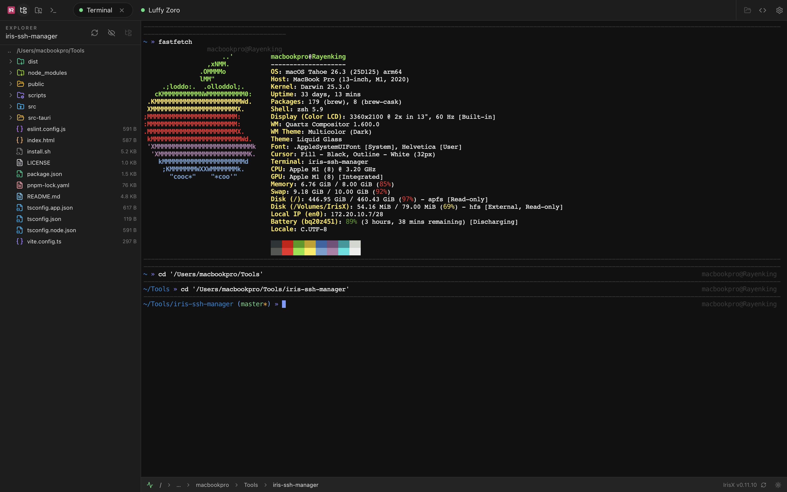
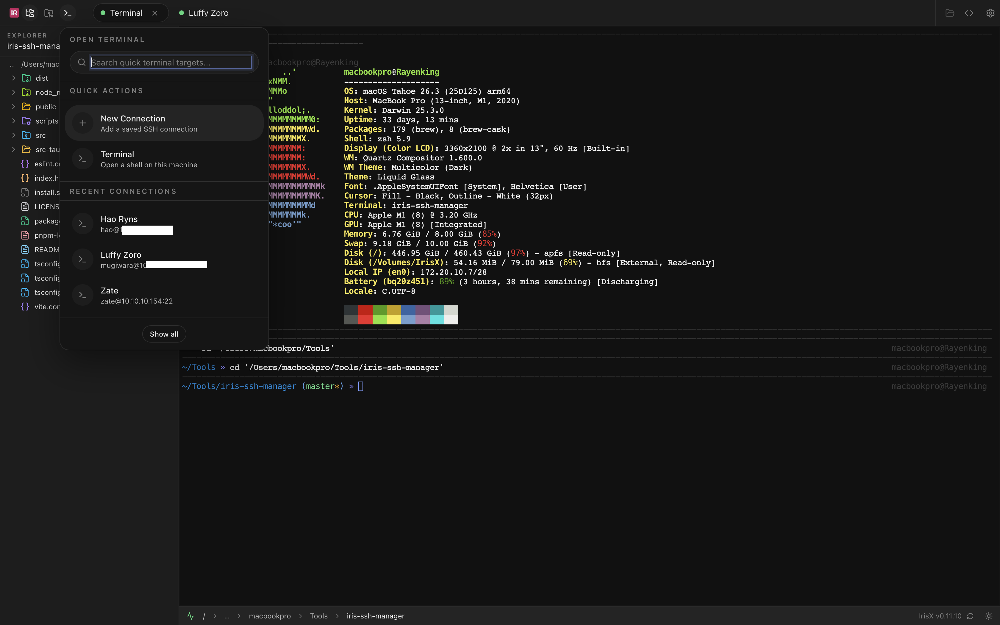
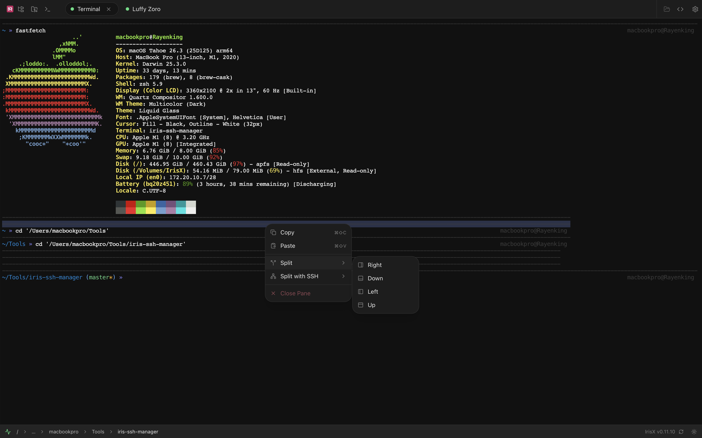
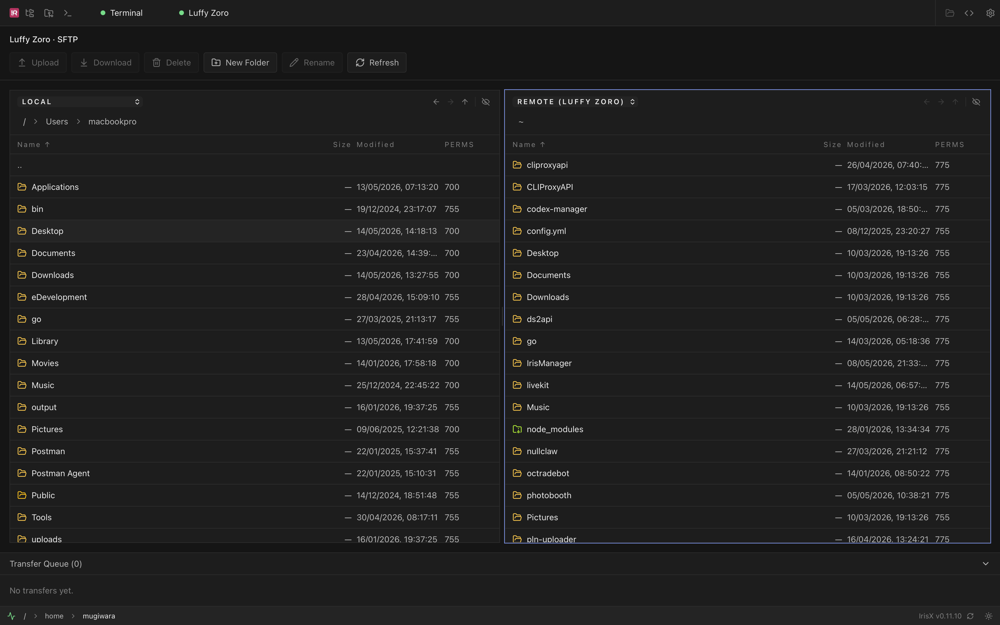
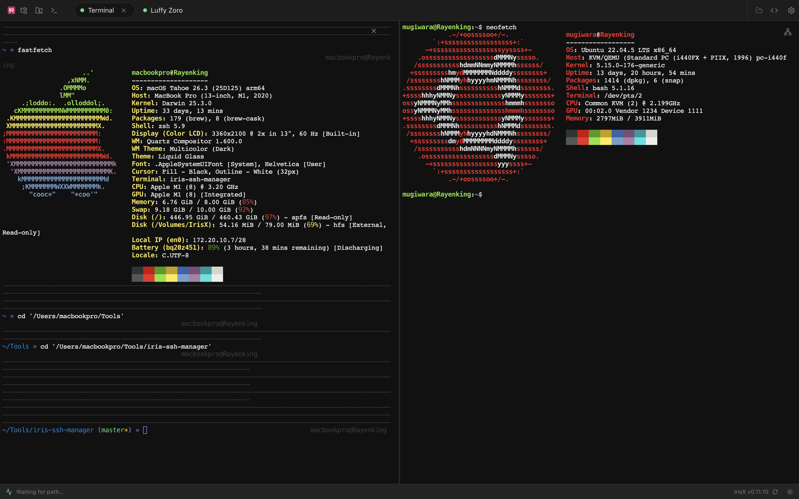
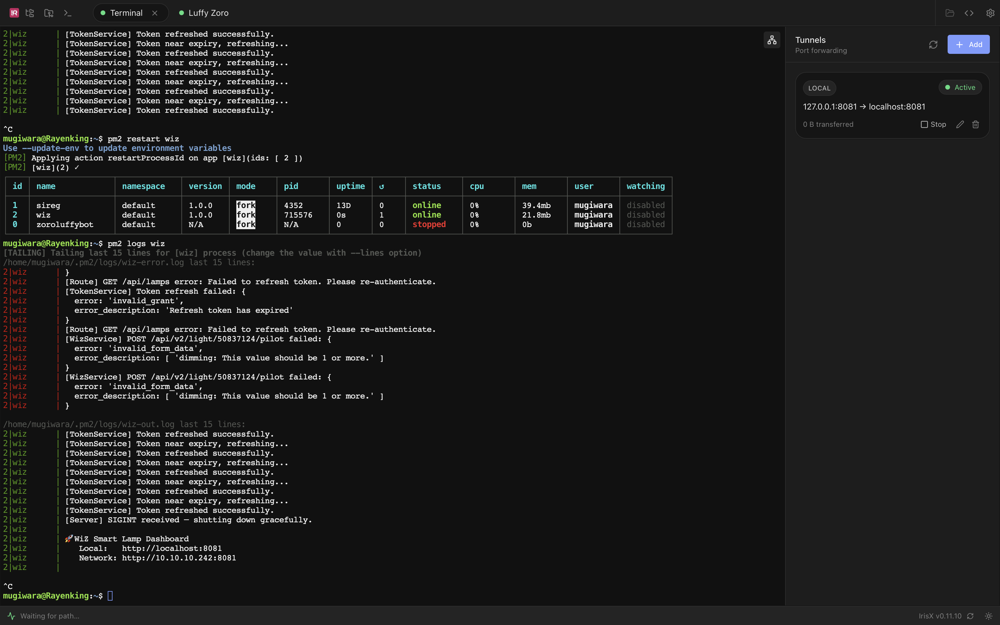

<p align="center">
  
</p>

<h1 align="center">IrisX</h1>

<p align="center">
  A modern, cross-platform SSH client and connection manager built with <b>Tauri 2.0</b> + <b>Rust</b> + <b>React</b> + <b>TypeScript</b> + <b>Tailwind CSS v4</b>.
</p>

<p align="center">
  Personal alternative to Termius / Bitvise SSH Client — fast, lightweight, and fully open source.
</p>

<p align="center">
  
  
  
</p>

## Screenshots

<p align="center">
  
</p>
<p align="center"><em>SSH Terminal — xterm.js with WebGL rendering</em></p>

<p align="center">
  
</p>
<p align="center"><em>Connection Manager — groups, search, and drag reorder</em></p>

<p align="center">
  
</p>
<p align="center"><em>Split Panes — multiple sessions side by side</em></p>

<p align="center">
  
</p>
<p align="center"><em>SFTP File Explorer — browse and manage remote files</em></p>

<p align="center">
  
</p>
<p align="center"><em>Connection Dialog — add or edit SSH connections</em></p>

<p align="center">
  
</p>
<p align="center"><em>Port Forwarding — local, remote, and dynamic tunnel management</em></p>

## Features

- **SSH Terminal** — xterm.js with WebGL rendering, Channel-based streaming via russh
- **Split Panes** — Split terminal right/left/top/bottom with draggable dividers
- **Local Terminal** — Spawn local shell sessions without SSH
- **Connection Manager** — CRUD with groups, search, drag reorder, SSH config import
- **SFTP File Browser** — Dual-pane with drag-and-drop, remote-to-remote transfers, context menu
- **Mini File Editor** — Side-panel editor/viewer with syntax highlighting for quick file edits beside the terminal
- **Code Review Panel** — Git changes list + syntax-colored diff preview without leaving the active terminal
- **Port Forwarding** — Local, remote, and dynamic (SOCKS5) tunnel management
- **Snippets** — Command snippets with variable substitution, scoped per connection or global
- **Command Palette** — Ctrl+K quick access to connections, snippets, and actions
- **OS Keychain** — Credentials stored in native keychain (macOS Keychain, Windows Credential Manager, Linux Secret Service)
- **Themes** — Dark Minimal + Iris Pink with instant switching
- **Auto-Reconnect** — Exponential backoff with working directory restore
- **In-App Updates** — Notification when new version is available
- **Keyboard Shortcuts** — Ctrl+K, Ctrl+N, Ctrl+W, Ctrl+Shift+C/V, Ctrl+Click URLs, and more

## Install

### One-line install (Linux / macOS)

```bash
curl -fsSL https://raw.githubusercontent.com/rayenking/irisx/master/install.sh | bash
```

### Download

Pre-built binaries for all platforms available on the [Releases page](https://github.com/rayenking/irisx/releases):

| Platform | Format |
|----------|--------|
| Linux | `.deb`, `.AppImage` |
| macOS | `.dmg` (Apple Silicon) |
| Windows | `.msi`, `.exe` |

### Build from source

```bash
git clone https://github.com/rayenking/irisx.git
cd irisx
pnpm install
pnpm tauri build
```

**Prerequisites:** Node.js 18+, pnpm, Rust 1.70+, system dependencies (see below).

<details>
<summary>System dependencies (Linux)</summary>

```bash
# Debian/Ubuntu
sudo apt install libwebkit2gtk-4.1-dev libappindicator3-dev librsvg2-dev libsecret-1-dev

# Arch Linux
sudo pacman -S webkit2gtk-4.1 libappindicator-gtk3 librsvg libsecret
```

</details>

## Development

```bash
# Install dependencies
pnpm install

# Run in development mode (Tauri + Vite hot reload)
pnpm tauri dev

# Type check
pnpm exec tsc --noEmit

# Rust check
cd src-tauri && cargo check

# Production build
pnpm tauri build
```

## Tech Stack

| Layer | Technology |
|-------|-----------|
| Framework | Tauri 2.0 |
| Backend | Rust (russh, rusqlite, tokio, keyring-rs) |
| Frontend | React 18 + TypeScript |
| Styling | Tailwind CSS v4 (CSS-first config) |
| Terminal | xterm.js + WebGL addon |
| State | Zustand |
| Icons | Lucide React |

## Architecture

```
src-tauri/src/
├── ssh/          # SSH session, SFTP, tunnels (russh)
├── db/           # SQLite with migrations (rusqlite)
├── keychain/     # OS keychain (keyring-rs) + file-based store for dev builds
├── config/       # SSH config parser
├── commands/     # Tauri IPC command handlers
└── lib.rs        # App setup, state management

src/
├── components/   # React UI (terminal, sftp, connections, settings, snippets)
├── stores/       # Zustand state (connection, terminal, split, ui, settings, snippets)
├── hooks/        # Custom hooks (useSSH, useSFTP, useTunnel, useLocalShell)
├── lib/          # Tauri API wrappers, keybindings, themes
├── types/        # TypeScript type definitions
└── styles/       # Tailwind themes (dark-minimal, iris-pink)
```

## Contributing

Contributions are welcome! Please:

1. Fork the repository
2. Create a feature branch (`git checkout -b feature/amazing-feature`)
3. Commit your changes (`git commit -m 'feat: add amazing feature'`)
4. Push to the branch (`git push origin feature/amazing-feature`)
5. Open a Pull Request

## License

This project is licensed under the MIT License — see the [LICENSE](LICENSE) file for details.
